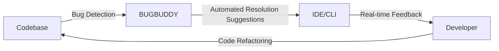

# 🐞 BugBuddy: AI-Powered Bug Detection and Resolution Platform
[](https://travis-ci.org/mehrshud/BugBuddy)
[](https://github.com/mehrshud/BugBuddy/blob/master/LICENSE)
[](https://github.com/mehrshud/BugBuddy/stargazers)
[](https://github.com/mehrshud/BugBuddy/tags)

## Overview
BugBuddy is an AI-powered bug detection and resolution platform designed to help developers identify and fix bugs in their codebase. With its advanced features and seamless integration with popular IDEs, BugBuddy is the perfect tool for any development team.

## Features
* **Bug Detection** 🐜: Identify bugs and errors in your codebase using our advanced machine learning algorithms
* **Automated Resolution Suggestions** 💡: Receive suggestions for fixing detected bugs, including code snippets and explanations
* **Integration with Popular IDEs** 📚: Seamlessly integrate with your favorite IDEs, including Visual Studio Code, IntelliJ, and Sublime Text
* **Real-time Feedback** 📊: Get instant feedback on your code quality, including bug detection, code smell detection, and code security analysis

## System Architecture
The following Mermaid diagram illustrates the system architecture of BugBuddy:


## Comparison with Other Bug Detection Tools
The following table compares BugBuddy with other popular bug detection tools:
| Tool | Bug Detection | Automated Resolution Suggestions | Integration with IDEs | Real-time Feedback |
| --- | --- | --- | --- | --- |
| BugBuddy | 🐜 | 💡 | 📚 | 📊 |
| CodeCoverage | 🐜 | ❌ | 📚 | ❌ |
| CodeSmellDetector | ❌ | ❌ | 📚 | 📊 |
| Bugzilla | 🐜 | ❌ | ❌ | ❌ |

## Quick Start
Get started with BugBuddy in minutes by following these simple steps:
1. Install BugBuddy using the installation instructions below
2. Integrate BugBuddy with your IDE or use the command-line interface
3. Start writing code and receive real-time feedback on bugs and errors

## Installation
To install BugBuddy, run the following command:
```bash
pip install bugbuddy
```
Alternatively, you can install from source:
```bash
git clone https://github.com/mehrshud/BugBuddy.git
cd BugBuddy
pip install -r requirements.txt
python setup.py install
```

## Usage Examples
Here are some examples of how to use BugBuddy:
### Initialize BugBuddy
```python
from bugbuddy import BugBuddy
bugbuddy = BugBuddy()
```

### Detect Bugs in a File
```python
bugs = bugbuddy.detect_bugs('path/to/file.py')
print(bugs)
```

### Get Automated Resolution Suggestions
```python
suggestions = bugbuddy.get_suggestions(bugs[0])
print(suggestions)
```

### Integrate with IDE
```python
from bugbuddy import BugBuddyIDE
bugbuddy_ide = BugBuddyIDE()
bugbuddy_ide.integrate_with_ide('visual_studio_code')
```

## API Documentation
For a comprehensive API documentation, please refer to our [API documentation](https://www.omnilertlab.com/bugbuddy/docs/api).

## Contributing Guidelines
We welcome contributions to BugBuddy! Please refer to our [contributing guidelines](https://github.com/mehrshud/BugBuddy/blob/master/CONTRIBUTING.md) for more information.

## Roadmap
Our roadmap for BugBuddy includes the following features:
* Improved bug detection algorithms
* Enhanced automated resolution suggestions
* Integration with more IDEs and development tools
* Support for more programming languages

## Community
Join our community to stay up-to-date with the latest developments and to connect with other BugBuddy users:
* [Twitter](https://twitter.com/bugbuddy)
* [GitHub](https://github.com/mehrshud/BugBuddy)
* [Slack](https://slack.com/bugbuddy)

## License
BugBuddy is licensed under the [MIT License](https://github.com/mehrshud/BugBuddy/blob/master/LICENSE).

## Acknowledgments
We would like to thank the following individuals and organizations for their contributions to BugBuddy:
* [Mehrshud](https://github.com/mehrshud)
* [OmniLab](https://www.omnilab.com)

## Frequently Asked Questions
Here are some frequently asked questions about BugBuddy:
* Q: What is BugBuddy?
A: BugBuddy is an AI-powered bug detection and resolution platform designed to help developers identify and fix bugs in their codebase.
* Q: How do I install BugBuddy?
A: You can install BugBuddy using pip: `pip install bugbuddy`.
* Q: How do I integrate BugBuddy with my IDE?
A: You can integrate BugBuddy with your IDE using our API: `from bugbuddy import BugBuddyIDE; bugbuddy_ide = BugBuddyIDE(); bugbuddy_ide.integrate_with_ide('visual_studio_code')`.